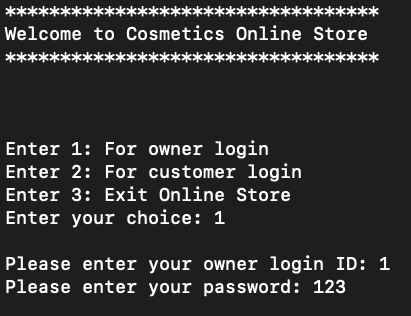
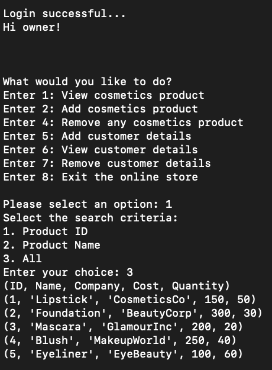
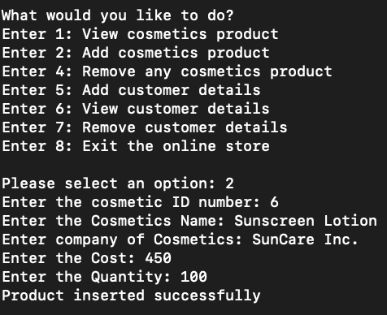
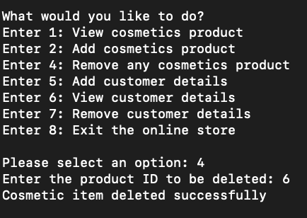
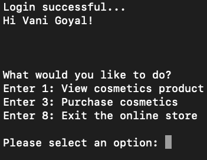
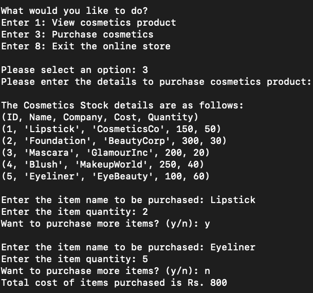

# Cosmetics Shop Management System

## Overview

The Cosmetics Shop Management System is a Python-based project designed to help cosmetic shop owners manage their inventory and customer details efficiently. This system provides an easy-to-use interface for adding, viewing, and removing products, as well as handling customer data. Additionally, it allows customers to view product details and calculate the total price of products they wish to purchase.

<p align="center">
  
</p>

## Table of Contents

- [Features](#features)
- [Advantages](#advantages)
- [Installation](#installation)
    - [Prerequisites](#prerequisites)
    - [Steps](#steps)
- [How to Run](#how-to-run)
- [Usage Scenarios](#usage-scenarios)
    - [1. Owner Login](#1-owner-login)
    - [2. View Cosmetic Products](#2-view-cosmetic-products)
    - [3. Add Cosmetic Products](#3-add-cosmetic-products)
    - [4. Remove Cosmetic Products](#4-remove-cosmetic-products)
    - [5. Customer Login](#5-customer-login)
    - [6. Purchase Cosmetics](#6-purchase-cosmetics)
- [Scope for Improvement](#scope-for-improvement)
- [More Details](#more-details)

## Features

- 🛍️ **Product Management**: Add, view, and remove cosmetic products from the inventory.
- 👥 **Customer Management**: Add, view, and remove customer details.
- 🔒 **Authentication**: Separate login credentials for shop owners and customers to ensure secure access and prevent unauthorized activities.
- 📦 **Inventory Tracking**: Keep track of product details and stock quantities.
- 💰 **Cost Calculation**: Calculate the total price of products selected by customers.

## Advantages

- 🚀 Automates the management of cosmetic stock, saving time and effort.
- 🧑‍💼 Allows shop owners to effectively manage inventory and customer details.
- 🔐 Ensures data security with authenticated access.
- 🔍 Provides various search criteria for viewing products.
- 💵 Facilitates customers in calculating the total price of products they wish to purchase.

## Installation

### Prerequisites

- 🐍 Python 3.x
- 🐬 MySQL

### Steps

1. **Clone the repository**:
    ```sh
    git clone https://github.com/vgalpha/cosmetics-shop-management-system.git
    cd cosmetics-shop-management-system
    ```

2. **Install the required Python packages**:
    ```sh
    pip install -r requirements.txt
    ```

3. **Set up the MySQL database**:
    - Create a database named `cosmetics`.
    - Run the SQL script located in the `db.sql` file to create the necessary tables and insert sample data:
      ```sh
      mysql -u yourusername -p yourpassword cosmetics < db.sql
      ```

## How to Run

1. **Run the script**:
    ```sh
    python main.py
    ```

2. **Login as Owner**:
    - Use the following credentials:
      ```
      Login ID: 101
      Password: 123
      ```

3. **Login as Customer**:
    - Use the sample customer credentials (e.g., ID: 1, Password: 123).

## Usage Scenarios

### 1. Owner Login

 <!-- Page 17 -->

### 2. View Cosmetic Products

 <!-- Page 18 -->

### 3. Add Cosmetic Products

 <!-- Page 19 -->

### 4. Remove Cosmetic Products

 <!-- Page 20 -->

### 5. Customer Login

 <!-- Page 21 -->

### 6. Purchase Cosmetics

 <!-- Page 22 -->

## Scope for Improvement

- 🛒 Add an online ordering system to enable customers to place orders directly.
- 👥 Support for multiple owners with separate accounts.
- 🔒 Enhance password security by masking password input.
- 🗂️ Add categories for cosmetic products like facewash, powder, etc.
- 🧾 Incorporate tax and discount calculations in the total cost displayed to customers.

## More Details

For more details about the project, refer to the [Project Report](https://github.com/vgalpha/cosmetics-shop-management-system/blob/main/Cosmetics_Shop_Project_Report.pdf).
